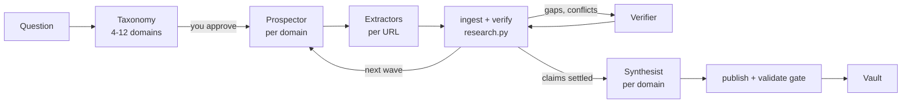

# megavault

`megavault` is a Claude Code skill that turns a research question into a set of evidence-graded Markdown notes. Subagents find sources, cache each page's text during the run, and link verbatim excerpts to claims. A deterministic script, not a model, then checks every excerpt against its cached page and assigns each claim's status (`supported`, `qualified`, `disputed`, `unsupported`, `refuted`) from those quote checks and from how many distinct origin groups back the claim. A separate verifier agent reviews disputed, qualified and central claims for entailment and scope; its narrowed claims and contradictions go back into the run, but its rulings do not change a status automatically. The output is an Obsidian-style vault: a claim ledger, a source register, a contradictions log, a gaps list, and readable notes that a writing agent is instructed to base only on the claims that have accepted evidence.

It exists because much AI research output reads as sourced without being checkable. Here a reader can follow each claim to the quoted passages behind it, each checked against the page it came from, or see that it has none, and how strong that support is.

## Measured on real runs

Measured over 24 research runs by the author. The runs themselves, their topics and their notes are not published; these are aggregate counts, recomputable on your own runs with `skills/megavault/scripts/maintenance/run_stats.py`.

| | |
|---|---|
| Source records across runs | 727 (546 fetched during a run, 101 adopted from an existing vault, 80 from early runs before origin was recorded) |
| Claims with a computed status | 2,901 |
| Quote records | 4,915 (4,653 checked against a cached page; 247 adopted from an existing vault and 15 without a cached page were not re-checked) |
| Notes written | 469 |

- **Claim status:** 35.6% supported, 39.3% qualified, 18.2% unsupported (plus 6.5% superseded by a later claim, 0.2% disputed, 0.1% refuted). An `unsupported` claim has no accepted quote behind it. This is not an accuracy rate: a status says how well a claim is backed by checked quotes, not whether the claim is true.
- **Quote check:** of all quote records, 4.7% did not match their cached page and were not accepted as evidence; 3.2% matched only after normalising punctuation, hyphenation and whitespace, or approximately (similarity at or above 0.92), in both cases with identical numbers and no flipped negation or direction word, and were accepted as `fuzzy` (that is the current rule; the earlier runs in this sample used a looser fuzzy rule without the meaning check); 0.3% had no cached page. In the runs where mismatches were inspected, most were formatting differences (table pipes, broken characters, PDF hyphenation and line numbers) rather than paraphrases, so the check errs on the strict side.
- **Reliability:** after crash-safe ingest and `resume` were added, three interrupted runs (each stopped twice) all finished from their run store. Three runs: an early result, not a rate.
- **Engineering:** 169 offline tests run without network or model calls; the instructions loaded on every call fit in about 7 KB.

Not measured: accuracy against a human audit, a baseline against an ungated pipeline, or repeat runs of the same question. Token figures are approximate.

## How it works

Terms used below: the **vault root** (the `--brain` flag; called *the brain* in the docs) is one git-tracked folder whose `README.md` has a `## Router` table. Each research topic is published into it as a **vault**, a subfolder. **First-hand areas** (`field-notes/`) hold your own notes; the tool validates them but never writes them.

Four subagent roles, each with a bounded job, coordinated by the main Claude Code session:

| Role | Model | Job |
|---|---|---|
| Prospector | Opus | Scouts one domain of the question. Picks which sources are worth reading. Returns a ranked URL shortlist and a claim skeleton. |
| Extractor | Sonnet | Fetches the chosen URLs, caches the raw text, returns verbatim excerpts with locators. Transcribes, does not judge. |
| Verifier | Opus | Judges whether each excerpt actually entails its claim and whether the claim's scope exceeds the evidence. Returns rulings, narrowed claims and contradictions; does not set status. |
| Synthesist | Opus | Writes notes from accepted claims only and adds no new facts (an instruction, see [Limits](#limits)). |



The coordinator loop:

1. Propose a taxonomy of 4 to 12 domains and stop for your approval. Only recon searches run before that; no worker is dispatched until you approve.
2. Run a wave: one prospector per domain, then extractors on the chosen URLs. Workers write JSON into the run's inbox.
3. `ingest` (the only path from worker results into the run store) and `verify` (the only thing that sets claim status). A quote not found in the cached page is rejected; a near match counts only if it keeps the page's digits and changes no negation, direction or quantity word.
4. Send the verifier over disputed, qualified and central claims. Its new or narrowed claims, edges and contradictions are ingested like any worker's; its entailment rulings are applied by the coordinator, not read by the engine. Open gaps feed the next wave.
5. One synthesist per domain writes notes.
6. Publish behind a validation gate (broken links, orphan notes, metadata, claim anchors). Writes into an existing vault use five verbs only (create, append-row, patch-cell, append-section, append-entry), and a merge plan is shown for approval first.

The run store (`~/.claude/research-runs/<run-id>/`) is the system of record, not the conversation. If a session dies, `resume` continues from the last completed step.

## Requirements

- [Claude Code](https://code.claude.com/docs), with subagents. Discovery uses Claude Code's WebSearch and WebFetch tools; no API keys. Extractors and verifiers fetch raw pages themselves with `curl` (or Python) through Bash, so WebFetch permission rules do not cover those fetches (see [Security](#security)).
- Python 3.10 or newer (tested on 3.10). Standard library only, nothing to `pip install`.
- git. The vault you publish into should be a git repository: the coordinator is instructed to check for a clean `git status` before writing into it and to commit afterwards. The engine itself does not check.
- Obsidian, optional. The output is plain Markdown with wikilinks.
- `curl` or Python on PATH (extractors and verifiers fetch raw pages through Bash with `curl`: https only, size and redirect limits; a URL is refused before the fetch when it carries credentials or names a loopback, link-local or private host, but a redirect reached during the fetch is not re-checked).
- Node.js 18 or newer, only for the `npx` install path. The skill itself does not use Node.

## Install

### As a Claude Code plugin (recommended)

This repository is both the plugin and its own plugin marketplace. From your shell:

```sh
claude plugin marketplace add bn0a/megavault
claude plugin install megavault@megavault
```

Or inside a Claude Code session:

```text
/plugin marketplace add bn0a/megavault
/plugin install megavault@megavault
```

In a session, `/plugin install` opens the plugin's details so you can pick a scope before installing; run `/reload-plugins` afterwards, or restart Claude Code.

This installs the skill and the four subagents together. Then, in Claude Code:

```text
/megavault plan <question>
```

The skill's full name is `/megavault:megavault`; the short `/megavault` works unless another skill or command is also called `megavault`.

| Task | Shell | In a session |
|---|---|---|
| Update | `claude plugin marketplace update megavault`, then `claude plugin update megavault@megavault`; the new version loads in the next session | No session form; or turn on auto-update for the `megavault` marketplace in `/plugin` → **Marketplaces** (off by default for third-party marketplaces) |
| Uninstall | `claude plugin uninstall megavault@megavault` | `/plugin uninstall megavault@megavault` |
| Remove the marketplace too | `claude plugin marketplace remove megavault` (also uninstalls its plugins) | `/plugin marketplace remove megavault` |

An update installs the new version into a fresh directory, so edits you made inside the installed copy (for example to `scripts/source_profiles.json`) do not carry over. Keep your own copy of anything you edit there.

### Other install options

Both copy the same files into your Claude Code config directory instead of going through the plugin system. With these, the subagents are named `research-prospector` and so on, without the `megavault:` prefix, and the command is `/megavault`.

**npx from GitHub** (the package is not published to the npm registry; this fetches it straight from this repository):

```sh
npx github:bn0a/megavault install
```

npm downloads the repository from GitHub (git must be on PATH) and runs the installer in it. The installer copies `skills/megavault/` and `agents/*.md` into your Claude Code config directory, prints every file it installed, and checks that Python 3.10 or newer is on PATH (it warns, it does not fail). It does the same on macOS, Linux and Windows. Apart from that download, nothing goes over the network.

| Command | What it does |
|---|---|
| `npx github:bn0a/megavault install` | Install into `~/.claude` (or `$CLAUDE_CONFIG_DIR` if set). Refuses if any of the files already exist. |
| `npx github:bn0a/megavault install --force` | Overwrite the package's files in an existing install. Files you added under the skill directory are kept and listed. |
| `npx github:bn0a/megavault install --claude-dir <path>` | Install into another config directory, for example a test directory. |
| `npx github:bn0a/megavault install --dry-run` | Print what would be installed; change nothing. |
| `npx github:bn0a/megavault uninstall` | Remove the files `install` copies: the skill's `SKILL.md`, the files the package ships under `scripts/` and `references/`, and the four agent files. Files you added under the skill directory are kept and listed. Takes `--claude-dir` and `--dry-run`. |

`install` is the default command, so `npx github:bn0a/megavault` alone also installs. Exit codes: `0` ok, `1` refused or usage error, `2` error.

**Manual copy**, from a clone of this repository. Copy these and nothing else (do not copy the whole repo; that brings `.git` and `tests/` along):

```sh
mkdir -p ~/.claude/skills ~/.claude/agents
cp -R skills/megavault ~/.claude/skills/
cp agents/*.md ~/.claude/agents/
```

Resulting tree (npx produces the same):

```text
~/.claude/
  skills/megavault/
    SKILL.md                     coordinator protocol
    scripts/research.py          the engine: ingest, verify, publish, validate
    scripts/source_profiles.json source-quality profiles (data, editable)
    scripts/maintenance/         audits (read-only except retrofit_claim_index.py --apply) + run_stats.py
    references/                  taxonomy, operations, evidence, sources, expand, data, publishing, field-notes
  agents/
    research-prospector.md
    research-extractor.md
    research-verifier.md
    research-synthesist.md
```

Restart Claude Code after installing so it picks up the skill and the agents. Do not install both the plugin and a copy: you would get two `megavault` skills and two sets of agents.

### Environment variables

| Variable | What it sets | Default |
|---|---|---|
| `RESEARCH_VAULT_ROOT` | The vault root you publish into (the default for `--brain`). Also the parent folder for a fresh scratch vault, unless it is a vault root (see below) | `./vault` |
| `RESEARCH_RUNS_ROOT` | Where run stores live | `~/.claude/research-runs` |
| `RESEARCH_BRAIN_ROOT` | Another name for the vault root when resolving `--brain`, checked after `RESEARCH_VAULT_ROOT`. It does not set the fresh-vault parent | none |

CLI flags override them per call: `--brain` (vault root; an explicit path that is missing or not a vault root stops the command, it never falls back to the variables), `--vault-root` (fresh-vault parent), `--runs-root`. The last two go before the command: `research.py --runs-root DIR status`.

A fresh `publish` (no `--vault`, no `--out`) never writes inside a vault root. If its parent folder is a vault root or lies inside one, the scratch vault goes to the run directory instead (`~/.claude/research-runs/<run-id>/vault/<slug>/`). To publish into the vault root, use `publish --brain <root> --vault <name>`.

## Quickstart

1. Create an empty vault root. The engine treats a folder as a vault root only if its `README.md` has a `## Router` heading; the table under it is where each published topic gets a row.

   ```sh
   mkdir ~/research-vault && cd ~/research-vault
   git init
   cat > README.md <<'EOF'
   # Research vault

   ## Router

   | Vault | When to look here | Entry point |
   |---|---|---|
   EOF
   git add README.md && git commit -m "Empty research vault"
   export RESEARCH_VAULT_ROOT=~/research-vault
   ```

   On Windows PowerShell:

   ```powershell
   mkdir ~\research-vault; cd ~\research-vault
   git init
   Set-Content README.md "# Research vault`n`n## Router`n`n| Vault | When to look here | Entry point |`n|---|---|---|" -Encoding utf8
   git add README.md; git commit -m "Empty research vault"
   $env:RESEARCH_VAULT_ROOT = "$HOME\research-vault"
   ```

   Either snippet sets the variable for the current shell only. Start Claude Code from that shell, or set the variable in your shell profile, so the session sees it; otherwise a scratch vault lands in `./vault` of the session's working directory.

2. In Claude Code:

   ```text
   /megavault plan How do light level and watering interval change the growth of pothos cuttings? --mode small
   ```

   This step creates the run, so pick its budget mode here: `--mode small|standard|vault` (default `standard`; see [Configuration](#configuration)). Start with `small`: in the measured runs, a standard run of 5 to 10 domains used roughly 1.4 to 7 million subagent tokens. You get a proposed taxonomy of domains. Approve it, edit it, or cut it. Only recon searches run before your approval.

3. Run it:

   ```text
   /megavault run
   /megavault status
   ```

   `run` executes the waves, verification and synthesis within the mode's ceilings. `status` shows coverage, claim statuses and the remaining budget at any time.

   At the end, `run` writes a scratch copy of the vault. Because `RESEARCH_VAULT_ROOT` is a vault root, that copy goes into the run directory, not into your vault, so the vault stays clean for step 4.

4. Publish into the vault:

   ```text
   /megavault publish --brain ~/research-vault --vault houseplants
   ```

   Publishing into a vault root is a dry run until `--apply` is added; the dry run builds the vault in staging, checks basename collisions across the whole vault root, and runs the validation gate.

What you get, under `~/research-vault/houseplants/`:

- `00 Houseplants Home.md`, the entry page, plus one folder and map-of-content page per domain.
- `90 Evidence/`: Claim Ledger (every claim, its status, scope and caveat; read this first), Source Register (with the source profile and every policy exception the run used), Evidence Map (every quote and its check result), Contradictions, Gaps and Backlog, Wanted Notes.
- `99 Meta/`: Validation Report and Change Log.
- A new row in the router table of `README.md`.

The full run (cached pages, records, packets, reports) stays in `~/.claude/research-runs/<run-id>/`.

Other modes: `expand` (research what an existing vault still lacks), `extract` (data tables with cell-level checks), `resume`, `validate`, `policy`. See [USERMANUAL.md](USERMANUAL.md).

## Configuration

- **Budget modes**: `small` (12 sources, 1 wave), `standard` (40, 2), `vault` (120, 3). Pass `--mode` to `plan`, which creates the run (or to `run` when it starts from a question). Per-worker limits (fetches, searches, reading tokens) and a run-wide subagent token ceiling (`max_subagent_tokens`, summed from the tokens recorded with `budget --spend`) are in `skills/megavault/references/operations.md` and can be changed with `budget --set`.
- **Source profiles**: `practitioner` (default), `open`, `strict-academic`, `sentiment`. They are data in `skills/megavault/scripts/source_profiles.json`; add your own there, including any field-specific allow-list of outlets you trust. Exceptions are recorded in the run and published, with their reasons, in the Policy section of the vault's Source Register.
- **Model tiering**: Opus for judgment roles, Sonnet for the extractor. For dense legal or numeric text, ask the coordinator to run the extractor on Opus (`--extractor opus`); for high-stakes topics, every role (`--all-opus`). These are coordinator instructions, not engine flags: the coordinator passes the model override when it dispatches workers.

## Tests

All tests run offline: no network, no model calls, throwaway vaults under the system temp directory.

```sh
python tests/run_offline.py                        # 74 scenario tests
python -m unittest -v tests.test_field_profile     # 88 first-hand validation tests
python -m unittest -v tests.test_run_stats         # 3 tests: run_stats counts and privacy
python -m unittest -v tests.test_installer         # 4 tests: the installer touches only its own files, runs no planted program and names its real install command (skipped without Node.js)
```

Run them from the repository root. `tests/test_offline.py` is a pytest shim over `run_offline.py` and adds no cases.

## Limits

- Discovery sets the ceiling. Verification only rejects; a source nobody found cannot correct a claim.
- `supported` means at least one passage an agent linked to the claim as support passed the quote check against the cached page, from two distinct origin groups where the claim's type or importance requires it. Entailment is a model judgment: the extractor's when it links the passage, the verifier's only for claims sent to it. It is not an independent fact check, and there is no measured accuracy rate.
- Entailment and scope judgments are as good as the model making them. Only the quote match and the count of distinct origin groups are checked mechanically. The cached text is written by the extractor, and origin-group labels are assigned by the agents.
- The quote check catches formatting differences, not changes of meaning. A near match (`fuzzy`) is refused when it changes a digit or a negation, direction or quantity word, but another one-word change (an antonym that list does not name) can pass, and the Evidence Map shows the extractor's quote, not the page's. Whether a passage says what the claim says is the verifier's judgment, made only for the claims sent to it.
- The synthesist's "accepted claims only, no new facts" rule is an instruction. `ingest` does not check a note's claim ids, and the gate warns, but does not block, when a note cites an unsupported or refuted claim.
- It is token-heavy. In the few runs where tokens were recorded, 5 to 10 domains used roughly 1.4 to 7 million subagent tokens each. In these runs, sessions hit a ceiling of about 200 WebSearch calls and 20 concurrent subagents (observed, not documented limits), which caps the size of one session's run.
- The non-English prose warning for first-hand notes is a stop-word and non-ASCII-letter heuristic covering a handful of European languages; it is a hint, not a language detector.
- Paywalled, JavaScript-only or bot-blocked pages cannot be cached, so they cannot be evidence. They become gaps.
- The output format is opinionated: Obsidian-style wikilinks, a `## Router` README convention, a fixed claim-ledger table shape. It is not a general note-taking or scraping tool.
- Writes are atomic but not fsynced; a power cut mid-write can lose the most recent write.
- `skills/megavault/scripts/research.py` is one large file by design: it is the single place to check whether the model did something the script should have done.
- Developed and used mainly on Windows with Python 3.10. The code is path-independent; macOS and Linux have had less use.

## Security

- Subagents read untrusted web pages. All four hold `Read`, `Write`, `Glob`, `Grep` and `Bash`; the prospector and verifier also hold `WebSearch` and `WebFetch`, the extractor `WebFetch`; the synthesist has no web tool. Instructions inside a page are treated as data, but that is a model behaviour, not a guarantee.
- Raw pages are fetched with `curl` through Bash, outside WebFetch's permission rules. Run with permission prompts on: not `--dangerously-skip-permissions`, and no blanket `Bash(*)`, `Bash(curl:*)` or `Bash(python:*)` allow rules. Approve only `curl … -o <run cache>` fetches and `python …/research.py …` engine calls. Prefer a sandbox or container for long unattended runs.
- Enforced by the engine whatever the model does: a URL with `user:password@` or a non-public host (loopback, link-local, private, `localhost`) never enters a record; web text lands in tables, headings and quotes on one line with pipes escaped, so it cannot forge a row or a status; `validate` fails a note with Dataview, Templater, script or remote-embed content; publish checks every path before its first write; commands the engine prints shell-quote every value; `99 Meta/validation.json` holds no local path.
- Vault content is web-derived: review it before you share it.

## License

MIT. See [LICENSE](LICENSE).
