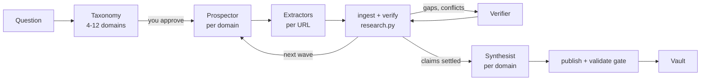

# /megavault — User Manual

Builds and extends navigable, evidence-graded Obsidian knowledge bases. Claims carry a status
that was *computed* from verified quotes, not asserted by a model.

**Terms.** The **vault root** (the `--brain` flag; called *the brain* below) is one git-tracked
folder whose `README.md` has a `## Router` table. Each research topic is published into it as a
**vault**, a subfolder. **First-hand areas** (`field-notes/`) hold your own notes; the tool
validates them but never writes them. **Reserved folders** (`qa/`, `backlog/`, `logs/`, `design/`)
are folders a vault root may keep for its own use; the tool reads them for basename collisions but
never writes into them. "I" below is the coordinator skill.

Fresh scratch vaults land in `<VAULT_ROOT>/<topic-slug>/` (default `./vault`, override with
`$RESEARCH_VAULT_ROOT` or `--vault-root`), except that a scratch vault never lands inside a vault
root: then it goes to the run directory. Vaults meant for the brain are published into it with
`publish --brain <root> --vault <name>`.

---

## Quickstart

These steps assume the plugin is installed (see [Install](#install)).

1. Create an empty vault root. The engine treats a folder as a vault root only if its `README.md` has a `## Router` heading; the table under it is where each published topic gets a row.

   ```sh
   mkdir ~/research-vault && cd ~/research-vault
   git init
   cat > README.md <<'EOF'
   # Research vault

   ## Router

   | Vault | When to look here | Entry point |
   |---|---|---|
   EOF
   git add README.md && git commit -m "Empty research vault"
   export RESEARCH_VAULT_ROOT=~/research-vault
   ```

   On Windows PowerShell:

   ```powershell
   mkdir ~\research-vault; cd ~\research-vault
   git init
   [IO.File]::WriteAllText("$PWD\README.md", "# Research vault`n`n## Router`n`n| Vault | When to look here | Entry point |`n|---|---|---|`n")
   git add README.md; git commit -m "Empty research vault"
   $env:RESEARCH_VAULT_ROOT = "$HOME\research-vault"
   ```

   Either snippet writes the same file (LF line endings, no byte-order mark) and sets the variable for the current shell only. Start Claude Code from that shell, or set the variable in your shell profile, so the session sees it; otherwise a scratch vault lands in `./vault` of the session's working directory.

2. In Claude Code:

   ```text
   /megavault plan How do light level and watering interval change the growth of pothos cuttings? --mode small
   ```

   This step creates the run, so pick its budget mode here: `--mode small|standard|vault` (default `standard`; see [Budget modes](#budget-modes)). Start with `small`: in the few runs measured in the [README](README.md#measured-on-real-runs) that recorded tokens, 5 to 10 domains used roughly 1.4 to 7 million subagent tokens each. You get a proposed taxonomy of domains. Approve it, edit it, or cut it. Only recon searches run before your approval.

3. Run it:

   ```text
   /megavault run
   /megavault status
   ```

   `run` executes the waves, verification and synthesis within the mode's ceilings. `status` shows coverage, claim statuses and the remaining budget at any time.

   At the end, `run` writes a scratch copy of the vault. Because `RESEARCH_VAULT_ROOT` is a vault root, that copy goes into the run directory, not into your vault, so the vault stays clean for step 4.

4. Publish into the vault:

   ```text
   /megavault publish --brain ~/research-vault --vault houseplants
   ```

   Publishing into a vault root is a dry run until `--apply` is added; the dry run builds the vault in staging, checks basename collisions across the whole vault root, and runs the validation gate. It ends by showing the vault name and prefix. Confirm them and I run it again with `--apply`, which moves the vault in and adds its router row. You can also type the second step yourself:

   ```text
   /megavault publish --brain ~/research-vault --vault houseplants --apply
   ```

What you get, under `~/research-vault/houseplants/`:

- `00 Houseplants Home.md`, the entry page, plus one folder and map-of-content page per domain.
- `90 Evidence/`: Claim Ledger (every claim, its status, scope and caveat; read this first), Source Register (with the source profile and every policy exception the run used), Evidence Map (every quote and its check result), Contradictions, Gaps and Backlog, Wanted Notes.
- `99 Meta/`: Validation Report and Change Log.
- A new row in the router table of `README.md`.

The full run (cached pages, records, packets, reports) stays in `~/.claude/research-runs/<run-id>/`.

Other modes: `expand` (research what an existing vault still lacks), `extract` (data tables with cell-level checks), `resume`, `validate`, `policy`. See [Modes](#modes) below.

---

## TL;DR

```text
/megavault plan How do X and Y actually work in 2026?     ← start here, costs little
  → you approve the taxonomy
/megavault run                                            ← the expensive part
  → vault appears, gate runs, you get a summary

/megavault expand <vault>                                 ← research over what a vault still lacks
/megavault extract <question> --into <vault>              ← pull numbers into a data table
/megavault publish --brain <root> --vault <name>          ← into the brain, with the router row
```

Installed as a plugin, `/megavault` is short for `/megavault:megavault`; type the full name if
another skill or command is also called `megavault`.

Open a vault in Obsidian and read **`90 Evidence/<Prefix> Claim Ledger.md`** first. It is the
whole run in one table.

---

## The one thing to understand

Research tools often produce prose that *sounds* sourced. This one separates what a machine can
check from what needs judgment, and tells you which is which.

**Checked by the script:**

- a cache file exists for the source (the extractor fetches the page and writes it; the script does not fetch)
- the quote appears verbatim in that cached text, or as a near match (identical once punctuation,
  hyphenation and PDF line numbers are ignored, or at least 0.92 similar) that keeps every digit and
  changes no negation, direction or quantity word. That catches formatting differences, not every
  change of meaning
- corroboration is counted by distinct origin-group labels (the labels themselves are an agent
  judgment, meant to keep five outlets repeating one press release in one group)
- in the published vault, every broken link is queued in Wanted Notes (an unqueued one fails the
  gate); no orphan notes; no missing metadata
- nothing hand-written in a vault is re-authored: writes use five verbs (create, append-row,
  patch-cell, append-section, append-entry); patch-cell changes one listed line, and the gate
  rewrites its own Validation Report

**Left to judgment** (as good as the model doing it, which is why those roles run Opus):

- whether a passage actually *entails* the claim, including whether a `fuzzy` quote still says
  what the page says
- whether the claim's scope exceeds its evidence
- whether a source is fit for that kind of claim

A source's tier and a claim's type and importance are also set by the agents that return them. They
decide the tier cap and whether a claim needs two origin groups.

The verifier reviews disputed, qualified and central claims. Its new or narrowed claims and
contradictions are ingested like any worker's; its entailment rulings are applied by me, the
coordinator, and never change a status on their own.

So when you read `supported` in the ledger, it means something specific. When you read
`qualified`, it means "real evidence, one origin — do not quote this as settled."

---

## How a run works

Four subagent roles, each with a bounded job, coordinated by the main Claude Code session:

| Role | Model | Job |
|---|---|---|
| Prospector | Opus | Scouts one domain of the question. Picks which sources are worth reading. Returns a ranked URL shortlist and a claim skeleton. |
| Extractor | Sonnet | Fetches the chosen URLs, caches the raw text, returns verbatim excerpts with locators. Transcribes, does not judge. |
| Verifier | Opus | Judges whether each excerpt actually entails its claim and whether the claim's scope exceeds the evidence. Returns rulings, narrowed claims and contradictions; does not set status. |
| Synthesist | Opus | Writes notes from accepted claims only and adds no new facts (an instruction, see [Limits and security](#limits-and-security)). |



The coordinator loop:

1. Propose a taxonomy of 4 to 12 domains and stop for your approval. Only recon searches run before that; no worker is dispatched until you approve.
2. Run a wave: one prospector per domain, then extractors on the chosen URLs. Workers write JSON into the run's inbox.
3. `ingest` (the only path from worker results into the run store) and `verify` (the only thing that sets claim status). A quote not found in the cached page is rejected; a near match counts only if it keeps the page's digits and changes no negation, direction or quantity word.
4. Send the verifier over disputed, qualified and central claims. Its new or narrowed claims, edges and contradictions are ingested like any worker's; its entailment rulings are applied by the coordinator, not read by the engine. Open gaps feed the next wave.
5. One synthesist per domain writes notes.
6. Publish behind a validation gate (broken links, orphan notes, metadata, claim anchors). Writes into an existing vault use five verbs only (create, append-row, patch-cell, append-section, append-entry), and a merge plan is shown for approval first.

The run store (`~/.claude/research-runs/<run-id>/`) is the system of record, not the conversation. If a session dies, `resume` continues from the last completed step.

---

## Modes

| Command | What it does | When |
|---|---|---|
| `/megavault plan <question> [--mode M]` | Creates the run with its budget mode, runs recon, then proposes a domain taxonomy. Stops for your approval. | Always start here |
| `/megavault run <question> [--mode M]` | The full pipeline, including the approval gate; creates the run when there was no `plan` | When you know the question is right |
| `/megavault expand <vault>` | Adopts an existing vault, ranks what it still lacks, researches your picks, merges back | Growing a base you already have |
| `/megavault extract <q> --into <vault>` | Data-table extraction (`--kind data`) | Spec sheets, pricing, benchmarks |
| `/megavault resume` | Continues the newest run | After an interruption |
| `/megavault status [--expand] [--budget]` | Coverage, open surface, budget | Any time, free |
| `/megavault publish --brain <root> --vault <name>` | A new vault into the brain + router row; `--vault plants/<name>` puts it in an existing group folder | A finished run you want agents to find |
| `/megavault publish --into <vault>` | Merges into an existing vault | After an expand run |
| `/megavault validate <vault>` \| `--brain <root>` | Runs the gate alone: on one vault (`--brain` only says where its links resolve), or on every vault in the brain | After hand-editing notes |
| `research.py validate --profile first-hand` | Checks first-hand areas (`field-notes/`, or any vault whose Home declares `vault_kind: first-hand`) and their callouts against their own schema | After adding or renaming a case study, guide or lesson |
| `/megavault policy …` | Switch source profile, or raise an exception | See *Profiles* below |

### Budget modes

| Mode | Sources | Waves | Opus/wave | Use for |
|---|---:|---:|---:|---|
| `small` | 12 | 1 | 2 | One bounded question |
| `standard` | 40 | 2 | 4 | Default. A real topic with several facets |
| `vault` | 120 | 3 | 6 | A field. Multi-domain |
| `expand` | 24 | 2 | 3 | Set automatically by `adopt` |

Pick one when the run is created: `/megavault plan <question> --mode vault` (or
`/megavault run <question> --mode vault` when you skip `plan`). After that, `budget --set` changes
single knobs.

---

## The approval gates — where your attention matters most

**Fresh run: the taxonomy.** Everything downstream is derived from it. Correcting it costs
nothing; correcting it after a wave costs a wave. When I show you 4–12 domains, check three
things: is anything missing (if a whole area is absent my recon missed it, so the neighbouring
domains are probably also mis-cut); are any two domains the same domain; is anything out of
scope. Two domains are always present by design — one owning measurement/evidence quality, one
owning limits, risks and open questions.

**Expand run: the pick-list.** Same role, different object. I show you a ranked list of what the
vault still lacks and propose which items to chase. Check that the picks are worth a wave, and
that nothing important is missing from the ranking.

**Before any write into a live vault: the merge plan.** I show you verb counts
(`create=1 append-row=3 patch-cell=2 …`), every hard stop, everything that needs a manual paste,
and anything flagged NEEDS REWRITE. Nothing is written until you say go.

**Names.** A vault's prefix is permanent. If I derived it from a folder name rather than being
told, I will ask — say yes or give me the right one.

---

## Walkthrough 1 — a fresh run

```text
/megavault plan How do light level and watering interval change the growth of pothos cuttings? --mode standard
  → the run is created, recon, then 6 proposed domains. You approve, edit, or cut.
/megavault run
  → wave 1: one prospector per domain, extractors on the chosen URLs
  → ingest → verify → status
  → wave 2: gaps and contradictions
  → synthesists, one per domain
  → vault written, gate run
```

You get: the counts, the open gap list, and a summary paragraph for your own notes.

---

## Walkthrough 2 — expanding an existing vault

The end-to-end command sequence, for when you want to run it yourself:

```shell
R=~/.claude/skills/megavault/scripts/research.py   # npm or manual install
# plugin install: R=<installPath>/skills/megavault/scripts/research.py, installPath from `claude plugin list --json`
V=$RESEARCH_VAULT_ROOT/mini

# 1. adopt: read the vault into a run. Prints the prefix and the next free IDs.
python $R adopt $V --brain $RESEARCH_VAULT_ROOT
#    ambiguous prefix? it stops and asks. Then: adopt $V --prefix Mini

# 2. see what the vault still lacks, ranked
python $R status --expand --run <run-id>

# 3. --- you approve a pick-list here ---

# 4. item-scoped packets, one per picked gap or claim
python $R packet --expand --pick GAP-002,CL-002 --domain D1 --role prospector --run <run-id>
#    → prospector → extractors → they write into <run>/inbox/ and <run>/cache/raw/
#    `--pick D2` alone picks every open gap, claim and MOC question of that domain;
#    add `--brief blind --brief-text '…'` for the second, skeleton-free prospector (see Elastic frame below)

# 5. the normal loop
python $R ingest --run <run-id>
python $R verify  --run <run-id>     # CL-002 qualified → supported, if a NEW origin group turned up
python $R status  --run <run-id>

# 6. synthesise, then plan the merge — dry run, always first
python $R merge-plan --run <run-id> --into $V
#    the reviewable table prints to stderr, the JSON summary to stdout

# 7. --- you approve the plan here ---

python $R publish --run <run-id> --into $V --apply
python $R validate $V
```

What to expect:

- The first new claim continues the vault's numbering (`CL-007`, not `CL-001`).
- The Home's `last_verified` is bumped and the run is listed in its `run_ids` (`run_id` stays the
  run that first published the vault); the Change Log entry names the run.
- Re-reading a source the vault already used does **not** promote a claim. Only a genuinely new
  origin group does. That is the whole point of expand mode.
- A one-claim promotion produces a one-line diff in the ledger (plus, once, the corrected
  status-rule sentence of a ledger published by an older version). A big diff for a small finding
  means something is wrong — tell me.
- Merging into an old vault that has no *Wanted Notes* file will show broken-link errors. Those
  are the vault's pre-existing errors, they are recorded as a baseline, and the merge is only
  blocked if it makes things *worse*. The first merge creates the Wanted Notes file.

---

## Elastic frame and coverage

Every domain can get two discoveries: the framed prospector and one with a `blind` or `frame-break` brief that never sees the first skeleton (`packet --brief blind --brief-text '…' --domain D2 --role prospector`; the engine withholds covered claims from that packet). Extractors add `off-skeleton` claims for findings that match no packet claim. At run end:

```shell
python $R coverage --run <id>                          # arms, overlap and Chapman estimate, off-skeleton per page, novelty curve → reports/coverage.json
python $R coverage --run <id> --sample 5 --seed 42     # deterministic sample of cached pages for a skeleton-free re-read
python $R coverage --run <id> --reread findings.json   # recall of the re-read against the claims (exit 1 on a malformed file)
```

The published Gaps and Backlog file then carries a `## Coverage` section (and `## Not researched` for domains that were deprecated before any work). Coverage is measured, never asserted: the Chapman estimate is `valid` only between two prospectors with the same brief, otherwise `indicative`; two prospectors with no claim in common give no estimate at all (`undefined (0 shared)`).

---

## Walkthrough 3 — a data extraction run

```text
/megavault extract Every 2026 LED grow light's wattage, coverage area and price --into $RESEARCH_VAULT_ROOT/grow-lights
```

Equivalent to `init --kind data`, then the normal loop, then a merge. What is different:

- Results land in `records/tables.json` as `DT-###` records, not as claims.
- Every row declares a **fidelity**: `verbatim` (read off the page), `derived` (must carry a
  formula and the verbatim inputs), `observed` (must carry an artifact file and an evidence note).
- `python $R datacheck --run <id>` checks every verbatim cell against the cached page, cell by
  cell: `exact` / `fuzzy` / `mismatch` / `no_cache`. It exits 1 if anything mismatched.
- A row that failed the check is still published — with a **⚠** and a line in the note's Gaps
  section. It is neither hidden nor trusted.
- Two sources giving different numbers for the same entity produce **two rows plus a
  Contradictions entry**. Nothing is ever averaged.
- The output is a `type: dataset` note inside the domain folder, with the entity column
  wikilinked whether or not those notes exist yet.

Don't ask me to adjudicate a spec table. Recording what each source says, dated and attributed,
is the deliverable; deciding which number is "right" is a separate claim with its own evidence.

---

## Walkthrough 4 — publishing into the brain

**The brain is under git.** Before a real write, make sure `git status` is clean; after a
publish/merge, `git add -- '<vault folder>' README.md && git commit` (never stage the whole brain: that
would also commit anything private lying elsewhere in it). A bad merge is then a `git diff` away from
diagnosis and a `git checkout -- '<vault folder>'` away from undone. (If your brain copy has no repo yet: `git init` +
baseline commit first.)

```shell
python $R router-row --vault houseplants --when 'light level, watering interval and soil mix'
#   prints the proposed router row and where it would go (under the vault's group section when the
#   router has one, else after the last row). Writes nothing. Default text: "TODO: describe when to open this vault".
#   A vault the router already lists gets no second row: the output carries its current counts
#   (sources, claims by status, open gaps, notes) and `row_update`, the same row with those counts
#   regenerated. Replace that one line with it.

python $R publish --run <id> --brain $RESEARCH_VAULT_ROOT --vault houseplants --prefix "Houseplants"
#   DRY RUN by default: builds in staging, lints staging ∪ brain, validates, reports, deletes staging

python $R publish --run <id> --brain $RESEARCH_VAULT_ROOT --vault houseplants --prefix "Houseplants" --apply
```

What the dry run is checking, and what will stop it:

- the brain root must have a `README.md` with a `## Router` section, or it is not a brain;
- with `--vault plants/<name>` the group folder `plants/` must already exist and must not itself
  be a vault; the vault's prefix still comes from `<name>`, and the router row reads `plants/<name>/`;
- the destination must not already exist — publish never overwrites a vault;
- no basename anywhere in the brain may collide with anything being created (the reserved
  folders are included in that check, though never written to); repeated `README`
  files are folder indexes and exempt, unless some note wikilinks a README by basename;
- the staged vault must validate clean.

With `--apply`, the vault moves in with `os.replace` and the router row is inserted line-exactly
after the last row of the README table. If the table cannot be located exactly, the row is
printed for you to paste — that is the designed behaviour, not a failure.

Finally, `python $R validate --brain $RESEARCH_VAULT_ROOT` checks the whole brain, and
`python $R lint-brain --brain $RESEARCH_VAULT_ROOT` reports duplicate basenames and prefix violations
across every vault. Older prefix problems are fixed **by hand** — rename, then `link-rewrite` —
never by a migration pass.

---

## Reading the output

| File | What it tells you |
|---|---|
| `00 <Prefix> Home.md` | Router. Domains, evidence layer, meta |
| `90 Evidence/<Prefix> Claim Ledger.md` | **Read this first.** Every claim, status, scope, action, caveat; the `## Claim index` under the table is where `#CL-###` links land |
| `90 Evidence/<Prefix> Source Register.md` | Every source with its tier and origin group; `## Policy` names the source profile and every exception you confirmed, with its reason |
| `90 Evidence/<Prefix> Gaps and Backlog.md` | What the run did *not* answer, and what closed it. A deliverable |
| `90 Evidence/<Prefix> Contradictions.md` | Conflicts, and whether they resolved |
| `90 Evidence/<Prefix> Evidence Map.md` | Every quote and its verification result — the audit trail |
| `90 Evidence/<Prefix> Wanted Notes.md` | Every broken link, grouped by the note that wants it. A to-write queue |
| `99 Meta/<Prefix> Validation Report.md` | Did the gate pass |
| `99 Meta/<Prefix> Change Log.md` | Which claims changed status, and any NEEDS REWRITE |

### Claim statuses

| Status | Means | How to treat it |
|---|---|---|
| `supported` | Accepted evidence, ≥2 distinct origin groups where required | Usable |
| `qualified` | Real evidence, but a central claim, or one typed numerical, causal, comparative or predictive, has one origin group — or the best support is capped by the profile (tier 5; tiers 4–5 under `strict-academic`) | Usable **with the caveat attached**. Never quote bare |
| `disputed` | Accepted evidence both ways | Present both sides. Never average |
| `unsupported` | No accepted supporting evidence | Not a finding |
| `refuted` | Accepted refuting evidence, no support | Actively wrong |
| `superseded` | A later claim carries `supersedes` for it | Kept, not deleted |

### Quote checks

| Result | Means |
|---|---|
| `exact` | Found verbatim in the cached page, or in the visible text of a cached HTML page. Accepted |
| `fuzzy` | Identical once punctuation, hyphenation and PDF line numbers are ignored (shown without a score), or at least 0.92 similar to the page with the same digits and no changed negation, direction or quantity word (score shown): a typo or a dropped word. Accepted. The quote shown is the extractor's; read it against the source before you quote it |
| `mismatch` | **Did not match the cached page.** Often formatting (table pipes, broken characters, quotes joined with an ellipsis), sometimes a paraphrase, or a near match that changed a digit or a negation, direction or quantity word (a high score with `meaning_change` in the record). Rejected; whatever depended on it lost its support |
| `no_cache` | The page was never cached. Rejected — cannot be evidence |
| `adopted` | Came in from an already-published vault. Kept as existing support, never re-checked, and **never counts as a new origin group** |

### NEEDS REWRITE

When a claim a note relies on goes `supported → refuted` or `supported → disputed`, the note's
prose is *not* edited. It gets a dated `## Update` section, the Change Log gets a NEEDS REWRITE
line, and I tell you. A human decides what the note should now say. The gate treats this as a
warning rather than a blocker on purpose — blocking would just stop the vault from recording
that the world changed.

---

## Profiles — how source quality is controlled

The default profile is **`practitioner`** (insider sources; anonymous forums rejected). Under `open`, quality shows up as a tier label, and a
claim resting only on tier-5 anecdote cannot rise above `qualified`. Forum posts are welcome;
they are just labelled honestly.

| Profile | Use it for |
|---|---|
| `open` | anything; nothing is rejected |
| `strict-academic` | only peer-reviewed, primary, official and standards material |
| `practitioner` | the above plus signed practitioner writing — conference talks, engineering write-ups, named technical blogs |
| `sentiment` | when forum and review text *is* the artifact; the tier ceiling is lifted |

```shell
python $R init --question '…' --profile strict-academic
python $R policy --run <id> --profile practitioner          # switch mid-run
python $R policy --run <id> --allow reddit.com --reason 'the dispute only exists here' --scope D5
#   → prints what it would do and STOPS (exit 3). Nothing changes until you confirm:
python $R policy --run <id> --allow reddit.com --reason '…' --scope D5 --confirmed
```

Rejections happen at ingest, mechanically, and each one opens a GAP naming the URL. Under every
profile, a URL with `user:password@`, another scheme, or a non-public host (loopback, link-local,
private, `localhost`) is refused outright (rule `url:refused`): no record, no gap, no credential
logged. An exception names a bare public host (`reddit.com`), never an address. Every
exception you confirm is **published** in the Source Register's Policy section, with its reason,
scope and date, beside the profile, so a reader can see what rules the base was collected under. Edit `scripts/source_profiles.json` in the skill directory to add your own
— it is data, not code. In a plugin install, an update replaces that directory, so keep a copy of your edits.

---

## Budget knobs

```shell
python $R status --budget                                   # what is left
python $R budget --set max_opus_per_wave=6 sources=60       # change it
python $R budget --set max_subagent_tokens=2000000          # a token ceiling for the whole run
python $R budget --spend w1-D1-prospector-1 184000          # record one worker's reported tokens
python $R init --question '…' --max-opus 2 --read-budget 8000
```

| Knob | Effect |
|---|---|
| `max_opus_per_wave` | Opus seats per wave. Prospector, verifier and synthesist each cost one |
| `read_tokens_per_agent` | reading budget for one worker |
| `fetches_per_agent` / `searches_per_agent` | page fetches / searches per worker; a prospector packet carries its own `max_searches` (8 or more in an expand packet or from wave 2 on; `packet --searches N` sets it) |
| `fanout` | how many URLs a prospector may shortlist |
| `sources`, `waves`, `workers` | run-level ceilings |
| `max_notes_per_synthesist` | notes one synthesist may return |
| `max_subagent_tokens` | subagent tokens for the whole run (0 = no ceiling); past it `packet` exits 3 unless `--force`, which is logged as a deviation |

**Opus seats reset only when the wave advances.** Nothing else clears them. Past the cap the
script refuses to emit an Opus packet at all — a gate, not a warning.

**When a worker hits a ceiling it stops and hands back** its unread URLs with a reason and an
expected yield. Each one becomes a GAP automatically, so a capped worker loses nothing but time.

Tokens are **recorded, never estimated**. The engine measures none: after each worker returns I
record the usage the harness reported for it with `budget --spend` (a result may also carry its own
`tokens` count; a `--spend` entry for the same task wins). `status` shows `tokens_used`,
`tokens_ceiling` and the sum per role from `reports/token-ledger.jsonl`, beside work units per
role, sources against the ceiling and waves used. A number that is not in that ledger is never reported.

---

## Model tiering

| Role | Model | Why |
|---|---|---|
| Prospector | Opus | Decides what to look for. Discovery sets the ceiling — verification can only reject, never discover |
| Extractor | Sonnet | Transcribes from a URL already chosen. Token-heavy, judgment-free, and its failure mode is caught mechanically |
| Verifier | Opus | Entailment and scope are where a weaker model rationalises |
| Synthesist | Opus | The difference between "causes" and "correlates with" |

Overrides: ask me for `--extractor opus` (dense legal or numeric passages) or `--all-opus` (high-stakes
health, finance or legal topics). They are not engine flags; I pass the model override when
dispatching workers.

---

## Troubleshooting

**`adopt` stopped with "prefix is ambiguous".** It will not guess a permanent identity. Give it
one: `adopt <vault> --prefix Mini`.

**A merge exited 2.** Hard stop, and nothing was written. Read the stops in the plan: a
brain-wide basename collision, an unprefixed target vault, an ID that already exists with
different text, or a target the tool never writes: a reserved folder (`qa/`, `backlog/`, `logs/`,
`design/`) or a first-hand area.

**"The vault changed since this plan was made."** Correct refusal — a plan is only replayable
while the files it read are untouched. Re-run `merge-plan` and review it again.

**A merge reported items under `manual`.** The five verbs could not express something — usually
an old table missing a column the new one has (`Origin group`, `Type`, `Importance`,
`Closed by`). Extend the header by hand, then paste the lines it printed. Losslessness is
forward-looking: an older table has nowhere to put newer columns.

**Broken-link errors in an old vault.** Expected until it has a *Wanted Notes* file. Merges still
work — the gate is regression against the vault's recorded baseline, not zero errors.

**`ingest` listed files under `not_ready`.** They were written less than 3 seconds ago or are not
valid JSON yet; a worker may still be writing them. They stay in the inbox, nothing is rejected:
run `ingest` again. One that stays invalid is a broken result — re-dispatch its saved packet.

**`packet` stopped with "Token ceiling reached".** The recorded tokens reached
`max_subagent_tokens`. Stop and report, raise it with `budget --set max_subagent_tokens=N`, or issue
one packet with `--force` (logged as a deviation).

**An edge has the wrong relation.** A relation is judged against the claim's own text. Correct the
one edge with `relabel-edge --edge EV-012 --relation qualifies --why '…'`, then run `verify`; the old
value and the reason stay on the edge and in `reports/ingest-log.jsonl`.

**Lots of `no_cache`.** Extractors are skipping the cache step. Re-dispatch that domain; if it
persists, ask for `--extractor opus`.

**A claim I know is true says `unsupported`.** That is the system refusing to take your word for
it. Either its evidence did not match the source, or nobody fetched a source that says it.

**Everything is `qualified`.** Single-origin evidence throughout — usually one primary source
that everyone repeats, which is itself a finding worth writing down. In an expand run it can also
mean the new sources were in origin groups the vault already had.

**I hand-edited notes and the gate now fails.** Expected — your notes need the same frontmatter
keys. `/megavault validate <vault>` says exactly which are missing.

**The gate reports "executable or remote-embedded content".** A note holds a Dataview, DataviewJS,
Templater or code-runner block, raw `<script>`/`<iframe>`-type HTML, or a remote image embed. Vaults
are core Obsidian only, because a reader with those plugins on would run the code when the note
opens. `ingest` already refuses a synthesist note like that (`rejected_notes`); web text in quotes and
table cells is published inert.

**`adopt` stopped with "rows that cannot be trusted".** An evidence table has a row with the wrong
number of cells, no closing pipe, or a repeated ID: what a raw newline or pipe inside a cell leaves
behind, next to which a forged row (a status nobody computed) can sit. Repair the rows by hand,
run `validate`, then adopt again. Vaults this version writes never have one.

---

## Install

### Requirements

- [Claude Code](https://code.claude.com/docs), with subagents. Discovery uses Claude Code's WebSearch and WebFetch tools; no API keys. Extractors and verifiers fetch raw pages themselves with `curl` (or Python) through Bash, so WebFetch permission rules do not cover those fetches (see [Limits and security](#limits-and-security)).
- Python 3.10 or newer (tested on 3.10). Standard library only, nothing to `pip install`.
- git. The vault you publish into should be a git repository: the coordinator is instructed to stop when it has no `.git`, to check for a clean `git status` before writing into it, and to commit afterwards (the vault folder and `README.md` only). The engine itself does not check.
- Obsidian, optional. The output is plain Markdown with wikilinks.
- `curl` or Python on PATH. Extractors and verifiers fetch raw pages through Bash with `curl`: https only, on redirects too, with size and redirect limits. An extractor without `curl` uses a Python one-liner that checks only that the first URL is https. The extractor and verifier are told to refuse a URL that carries credentials or names a loopback, link-local or private host, and the engine refuses such a URL at ingest, so it never becomes a source or a gap. Neither fetch re-checks the host a redirect leads to.
- Node.js 18 or newer, only for the `npx` install path. The skill itself does not use Node.

### As a Claude Code plugin (recommended)

This repository is both the plugin and its own plugin marketplace. From your shell:

```sh
claude plugin marketplace add bn0a/megavault
claude plugin install megavault@megavault
```

Or inside a Claude Code session:

```text
/plugin marketplace add bn0a/megavault
/plugin install megavault@megavault
```

In a session, `/plugin install` opens the plugin's details so you can pick a scope before installing; run `/reload-plugins` afterwards, or restart Claude Code.

This installs the skill and the four subagents together. Then, in Claude Code:

```text
/megavault plan <question>
```

The skill's full name is `/megavault:megavault`; the short `/megavault` works unless another skill or command is also called `megavault`.

| Task | Shell | In a session |
|---|---|---|
| Update | `claude plugin marketplace update megavault`, then `claude plugin update megavault@megavault`; the new version loads in the next session | No session form; or turn on auto-update for the `megavault` marketplace in `/plugin` → **Marketplaces** (off by default for third-party marketplaces) |
| Uninstall | `claude plugin uninstall megavault@megavault` | `/plugin uninstall megavault@megavault` |
| Remove the marketplace too | `claude plugin marketplace remove megavault` (also uninstalls its plugins) | `/plugin marketplace remove megavault` |

An update installs the new version into a fresh directory, so edits you made inside the installed copy (for example to `scripts/source_profiles.json`) do not carry over. Keep your own copy of anything you edit there.

### Alternatives: npx from GitHub, or a manual copy

Both copy the same files into your Claude Code config directory instead of going through the plugin system. With these, the subagents are named `research-prospector` and so on, without the `megavault:` prefix, and the command is `/megavault`. Use one install path only (see the end of this section).

**npx from GitHub** (the package is not published to the npm registry; this fetches it straight from this repository):

```sh
npx github:bn0a/megavault install
```

npm downloads the repository from GitHub (git must be on PATH) and runs the installer in it. The installer copies `skills/megavault/` and `agents/*.md` into your Claude Code config directory, prints every file it installed, and checks that Python 3.10 or newer is on PATH (it warns, it does not fail). It does the same on macOS, Linux and Windows. Apart from that download, nothing goes over the network.

| Command | What it does |
|---|---|
| `npx github:bn0a/megavault install` | Install into `~/.claude` (or `$CLAUDE_CONFIG_DIR` if set). Refuses if any of the files already exist. |
| `npx github:bn0a/megavault install --force` | Overwrite the package's files in an existing install. Files you added under the skill directory are kept and listed. |
| `npx github:bn0a/megavault install --claude-dir <path>` | Install into another config directory, for example a test directory. |
| `npx github:bn0a/megavault install --dry-run` | Print what would be installed; change nothing. |
| `npx github:bn0a/megavault uninstall` | Remove the files `install` copies: the skill's `SKILL.md`, the files the package ships under `scripts/` and `references/`, and the four agent files. Files you added under the skill directory are kept and listed. Takes `--claude-dir` and `--dry-run`. |

`install` is the default command, so `npx github:bn0a/megavault` alone also installs. Exit codes: `0` ok, `1` refused or usage error, `2` error.

**Manual copy**, from a clone of this repository. Copy these and nothing else (do not copy the whole repo; that brings `.git` and `tests/` along):

```sh
mkdir -p ~/.claude/skills ~/.claude/agents
cp -R skills/megavault ~/.claude/skills/
cp agents/*.md ~/.claude/agents/
```

Resulting tree (npx produces the same):

```text
~/.claude/
  skills/megavault/
    SKILL.md                     coordinator protocol
    scripts/research.py          the engine: ingest, verify, publish, validate
    scripts/source_profiles.json source-quality profiles (data, editable)
    scripts/maintenance/         audits (read-only except retrofit_claim_index.py --apply) + run_stats.py
    references/                  taxonomy, operations, evidence, sources, expand, data, publishing, field-notes
  agents/
    research-prospector.md
    research-extractor.md
    research-verifier.md
    research-synthesist.md
```

Restart Claude Code after installing so it picks up the skill and the agents. Do not install both the plugin and a copy: you would get two `megavault` skills and two sets of agents.

---

## Limits and security

### Limits

- Discovery sets the ceiling. Verification only rejects; a source nobody found cannot correct a claim.
- `supported` means at least one passage an agent linked to the claim as support passed the quote check against the cached page, from two distinct origin groups where the claim's type or importance requires it. Entailment is a model judgment: the extractor's when it links the passage, the verifier's only for claims sent to it. It is not an independent fact check, and there is no measured accuracy rate.
- Entailment and scope judgments are as good as the model making them. Only the quote match and the count of distinct origin groups are checked mechanically. The cached text is written by the extractor, and origin-group labels are assigned by the agents.
- The quote check catches formatting differences, not changes of meaning. A near match (`fuzzy`) is refused when it changes a digit or a negation, direction or quantity word, but another one-word change (an antonym that list does not name) can pass, and the Evidence Map shows the extractor's quote, not the page's. Whether a passage says what the claim says is the verifier's judgment, made only for the claims sent to it.
- The synthesist's "accepted claims only, no new facts" rule is an instruction. `ingest` does not check a note's claim ids, and the gate warns, but does not block, when a note cites an unsupported or refuted claim.
- It is token-heavy. In the few runs where tokens were recorded, 5 to 10 domains used roughly 1.4 to 7 million subagent tokens each. In these runs, sessions hit a ceiling of about 200 WebSearch calls and 20 concurrent subagents (observed, not documented limits), which caps the size of one session's run.
- The non-English prose warning for first-hand notes is a stop-word and non-ASCII-letter heuristic covering a handful of European languages; it is a hint, not a language detector.
- Paywalled, JavaScript-only or bot-blocked pages cannot be cached, so they cannot be evidence. They become gaps.
- The output format is opinionated: Obsidian-style wikilinks, a `## Router` README convention, a fixed claim-ledger table shape. It is not a general note-taking or scraping tool.
- Writes are atomic but not fsynced; a power cut mid-write can lose the most recent write.
- `skills/megavault/scripts/research.py` is one large file by design: it is the single place to check whether the model did something the script should have done.
- Developed and used mainly on Windows with Python 3.10. The code is path-independent; macOS and Linux have had less use.

### Security

- Subagents read untrusted web pages. All four hold `Read`, `Write`, `Glob`, `Grep` and `Bash`; the prospector and verifier also hold `WebSearch` and `WebFetch`, the extractor `WebFetch`; the synthesist has no web tool. Instructions inside a page are treated as data, but that is a model behaviour, not a guarantee.
- Raw pages are fetched with `curl` through Bash, outside WebFetch's permission rules. Run with permission prompts on: not `--dangerously-skip-permissions`, and no blanket `Bash(*)`, `Bash(curl:*)` or `Bash(python:*)` allow rules. Approve `curl … -o <run cache>` fetches; `python …/research.py …` engine calls; the extractor's two `python -c` one-liners only when they match `agents/research-extractor.md` (steps 1 and 2) character for character apart from the quoted URL and file name; and, in the vault root, the coordinator's `git status`, `git add -- '<vault folder>' README.md` and `git commit`. Refuse any other command. Prefer a sandbox or container for long unattended runs.
- Enforced by the engine whatever the model does: a URL with `user:password@` or a non-public host (loopback, link-local, private, `localhost`) never becomes a source, cache key, gap or policy URL (free text such as a verbatim quote is stored as written); web text lands in tables, headings and quotes on one line with pipes escaped, so it cannot forge a row or a status; `validate` fails a note with Dataview, Templater, script or remote-embed content; publish checks every path before its first write; commands the engine prints shell-quote every value; `99 Meta/validation.json` holds no local path.
- Vault content is web-derived: review it before you share it. A source title can still carry its own Markdown link, and a claim text can render as a heading or callout in the Claim index; neither changes a row or a status.

To report a vulnerability, see [SECURITY.md](SECURITY.md).

---

## Where things live

```text
~/.claude/skills/megavault/           the skill (npm or manual install; the repo's skills/megavault/)
                                     plugin install: <installPath>/skills/megavault/ in Claude Code's
                                     plugin cache, see `claude plugin list --json`
  SKILL.md                           orchestration protocol
  references/                        taxonomy, evidence, sources, operations, expand, data, publishing, field-notes
  scripts/research.py                all deterministic mechanics
  scripts/source_profiles.json       the source-quality profiles — yours to edit
  scripts/maintenance/               audits (read-only except retrofit_claim_index.py --apply), run_stats.py
~/.claude/agents/research-*.md       the four subagents (the repo's agents/; a plugin install loads them
                                     from <installPath>/agents/ as megavault:research-<role>)
<repo>/USERMANUAL.md                 this file (stays in the repository)
<repo>/tests/                        169 offline tests, no network, no models:
                                     run_offline.py (74), test_field_profile.py (88),
                                     test_run_stats.py (3), test_installer.py (4, needs Node.js)
~/.claude/research-runs/<run-id>/    canonical state — records, cached pages, reports
<VAULT_ROOT>/                        published scratch vaults (default ./vault)
<run-id>/vault/                      the scratch vault instead, when <VAULT_ROOT> is or lies inside a vault root
$RESEARCH_VAULT_ROOT                 the vault root ("brain") you publish into, if you set one
```

### Environment variables

| Variable | Sets | Default |
|---|---|---|
| `RESEARCH_VAULT_ROOT` | the vault root ("brain") to publish into; also the default parent for fresh scratch vaults, unless it is a vault root | `./vault` |
| `RESEARCH_BRAIN_ROOT` | alternative name for the brain root when resolving `--brain`, checked after `RESEARCH_VAULT_ROOT`; it does not set the parent of fresh scratch vaults | none |
| `RESEARCH_RUNS_ROOT` | where run directories live | `~/.claude/research-runs` |

The `--vault-root` CLI flag overrides `RESEARCH_VAULT_ROOT` for a single invocation; `--brain`
overrides the brain root the same way. `--vault-root` and `--runs-root` go before the command
(`research.py --runs-root DIR status`).

Resolution order for the brain: `--brain` → `$RESEARCH_VAULT_ROOT` → `$RESEARCH_BRAIN_ROOT` →
`./vault`. A directory whose `README.md` lacks a `## Router` section is refused as a brain root.
An explicit `--brain` (`~` expanded) is the only candidate: if it is missing or not a vault root
the command stops with exit 2 and writes nothing; it never falls back to the variables.
Resolution order for a fresh scratch vault's parent directory: `--out` (the vault directory
itself) → `--vault-root` → `$RESEARCH_VAULT_ROOT` → `./vault`; without `--out`, a parent that is
or lies inside a vault root is replaced by the run directory. No path is hardcoded to a
particular machine or account; set the env var (or pass the flag) that matches your setup.
Everything is path-independent — the same commands work on Windows and on Linux.

The run directory is the system of record. Vaults are a projection of it — you can delete and
re-publish a *fresh* vault at any time without losing evidence. Delete a run directory and its
cached pages are gone, so re-verification would need a fresh fetch.

To hand the skill to someone else, point them at the plugin (see [Install](#install)), or copy
`~/.claude/skills/megavault/` and the four `~/.claude/agents/research-*.md` files. There is no other state.
